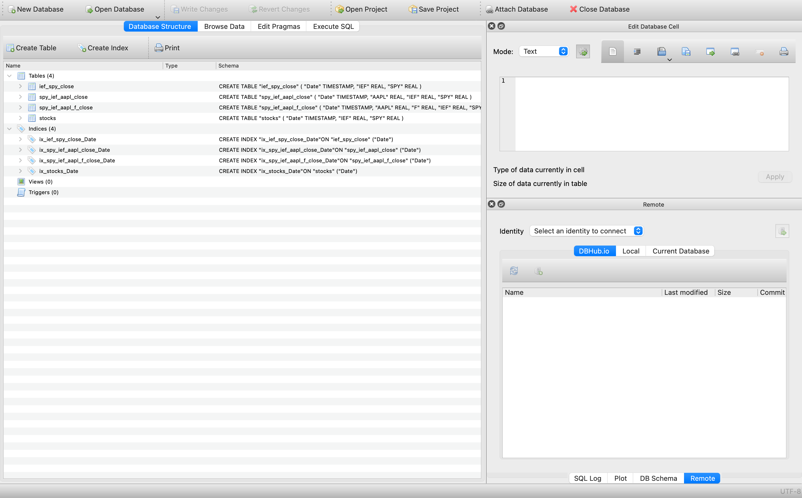

# stock-puller
UpWork job for Cody Clifford

# How to use (online):

## 1. Download a SQL database

Download a free SQL database. This will be where you can view the SQL table and run SQL queries on it. I suggest [DB Browser for SQLite](https://sqlitebrowser.org/dl/).

## 2. Navigate to Google Colab.

Navigate to this [link](https://colab.research.google.com/drive/1puwtJS2rXRsZMkDXbz0KY3SMtfMeoxrP#scrollTo=L4tJkU6O3n1P). Google Colab allows us to run programs using Google's cloud resources. It is necessary to ensure the program doesn't crash the computer when doing large data pulls (e.g. all US stocks).

## 3. Upload necessary files

1. Click on the Folder icon on the left side of the screen.
2. Click the "Upload to session storage" button.
3. Upload any csv of lists and the stocks.db file

## 4. Run the program

## 5. Download the results

Download the stocks.db file.

## 4. View Results

Open up the database program you downloaded earlier, navigate to the `stock-puller` folder on your `Desktop` and then open the `stocks.db` file from in the database program. You should now be able to see your tables (see image below)

The `Database Structure` section contains your table names. The `Execute SQL` section is where you can run SQL queries on your tables.

# How to use (locally - not suggested right now):

## 1. Download a SQL database

Download a free SQL database. This will be where you can view the SQL table and run SQL queries on it. I suggest [DB Browser for SQLite](https://sqlitebrowser.org/dl/).

### 2. Download any necessary Python libraries

To run this repository on your machine you will need to have both [yfinance](https://pypi.org/project/yfinance/) and [sqlite3](https://docs.python.org/3/library/sqlite3.html). Sqlite3 should already be included with your Python (you will still need to import the module on any script you write). You may have to download yfinance. To do so you just need to the run the following command in your terminal:

`pip3 install yfinance`

* Note: This assumes that you already have `pip3` installed as well. The easiest way is to download [homebrew](https://brew.sh/) and then run the command `brew install python3` (see [here](https://stackoverflow.com/questions/34573159/how-can-i-install-pythons-pip3-on-my-mac#:~:text=How%20could%20I%20install%20pip3%20on%20my%20Mac%3F&text=To%20install%20or%20upgrade%20pip,version%20which%20runs%20the%20script.) for more details). *

### 3. Set-up directory/run program

The next step is to download the code from [GitHub](https://github.com/Nhyland28/stock-puller), unzip the download, and save the folder containing the `README.md, stock_tracker.py, and stocks.db` files (there may at some point be more files in the folder, that is fine) to your desktop.

From here, we can run the program in the `terminal`  (often referred to as the command line):

1. Open the `terminal` program
2. Type in the command `cd` (this changes the working directory). This should change your directory to the base directory. If you type in `ls` you should see a list of different folders with one of them being `Desktop`.
3. Change to the `Desktop` folder with the command `cd Desktop`.
4. Type in `ls` to see the contents of `Desktop`. You should see the `stock-puller` folder that you unzipped.
5. Run the command `cd stock-puller` and then `ls`. You should see the `README.md, stock_tracker.py, and stocks.db` files (it is okay if there is also a file called `stocks.sqbpro`)
6. Now we can run the program. Type in `python3 stock_tracker.py` and then follow the prompts. If you want to build a table with SPY and IEF you would just type in `SPY, IEF` when prompted.

### 4. View Results

Open up the database program you downloaded earlier, navigate to the `stock-puller` folder on your `Desktop` and then open the `stocks.db` file from in the database program. You should now be able to see your tables (see image below)

The `Database Structure` section contains your table names. The `Execute SQL` section is where you can run SQL queries on your tables.
